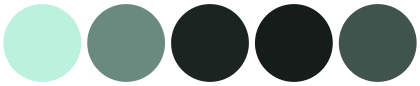

# ZestyTheme

A minimal and elegant theme for Jellyfin based/inspired by [Ultrachromic](https://github.com/CTalvio/Ultrachromic), [Glassmorphism](https://github.com/alexyle/jellyfin-theme), [Scyfin](https://github.com/loof2736/scyfin) & [JellyTheme](https://github.com/alexyle/jellyfin-theme).
 
Compatible with 10.9.x!

---

**Screenshots:**

Mobile:

---

### Installing

To add the theme to Jellyfin, copy the following line to Dashboard > General > Custom CSS:

`@import url('https://cdn.jsdelivr.net/gh/stpnwf/ZestyTheme@latest/theme.css');`

   
 
 
Plus **one** of the following lines **if** you'd like to change the default colors to one of the presets below (optional):

`@import url('https://cdn.jsdelivr.net/gh/stpnwf/ZestyTheme@latest/colorschemes/blue.css');`

`@import url('https://cdn.jsdelivr.net/gh/stpnwf/ZestyTheme@latest/colorschemes/coral.css');`

`@import url('https://cdn.jsdelivr.net/gh/stpnwf/ZestyTheme@latest/colorschemes/gray.css');`

`@import url('https://cdn.jsdelivr.net/gh/stpnwf/ZestyTheme@latest/colorschemes/green.css');`

`@import url('https://cdn.jsdelivr.net/gh/stpnwf/ZestyTheme@latest/colorschemes/purple.css');`

`@import url('https://cdn.jsdelivr.net/gh/stpnwf/ZestyTheme@latest/colorschemes/red.css');`

`@import url('https://cdn.jsdelivr.net/gh/stpnwf/ZestyTheme@latest/colorschemes/yellow.css');`

Then enable Backdrops in Jellyfin (Settings > Display > Backdrops) if you haven't already.¹ 

For more info on custom colors [click here](./colorschemes/COLORS.md)

---

Notes: 

 ¹ You must enable Backdrops on *every* device you plan to use this on.

 Theme is still **WIP**, and may look broken in some areas.

 I plan to get to theming TV mode (Settings > Display > Display Mode > TV) soon™. Looks broken right now.

---

Disclaimer:

 Theme has only been tested at 1080p (16:9), on both the app and the web interface. So it _may_ look broken on 720p, 2K and 4K screens or different screen ratios.

 I don't use the Live TV feature and neither Music Videos, so theme may look broken there. Not opposed to theming it, but hard to since I don't use it... 

 I am _not_ knowledgeable in CSS, but if the end result looks how I want it to, despite how hacky or messy the code may be, that's a win in my book... PRs are welcome.

---

**Things I'd like to do, if I can figure out how to (HELP WANTED):** 

Add profile pics back:

 Add season posters back:
 

 Turn seasons into a carousel to prevent this behavior:
 

 Make it so there is no "overflowing" entries in Genres after I increased Poster size

