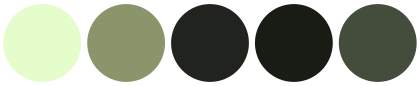

# Color schemes

---

**Template Colors:**




---

### Custom colors

To add theme to Jellyfin, copy the following line to Dashboard > General > Custom CSS:

`@import url('https://cdn.jsdelivr.net/gh/stpnwf/ZestyTheme@latest/theme.css');`

**If** you didn't like any of the presets and would like to have custom colors, replace the R, G, B values and paste it **underneath** the theme's `@import...` line:

```
:root {--accent: R, G, B;}
:root {--accent-off: R, G, B;}
:root {--dark: R, G, B;}
:root {--darkest: R, G, B;}
:root {--dark-highlight: R, G, B;}
:root {--dark-apparent: R, G, B;}
```

**Then** use a color picker on the *background color* anywhere in Settings or Dashboard, set `--dark-apparent` to that value, and save it. **Now you are done.**

If you don't do this, the backdrop gradient will not blend perfectly into the background on *mobile*. The background color is affected by the `--accent` color, so `--dark apparent` needs to be calculated for every color combination, hence why I made the presets...

---

Notes: 

 Check `theme.css` to see what each color does.
 
 Lighter `--accent` colors work better, as colorful colors - since accent color is overlayed on top of the background - will make the background color look very saturated.
 
